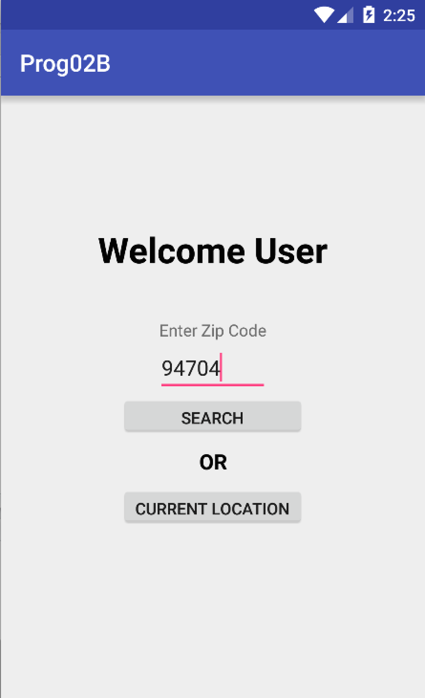
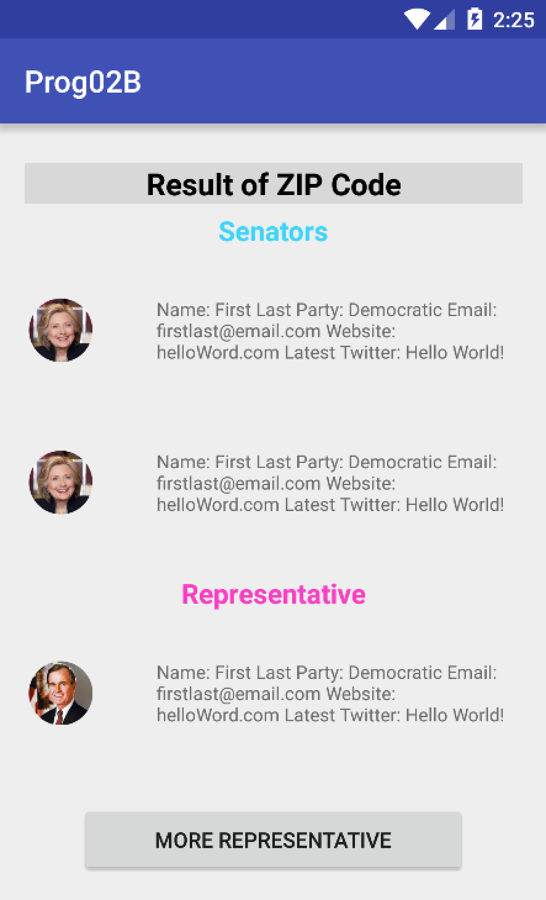
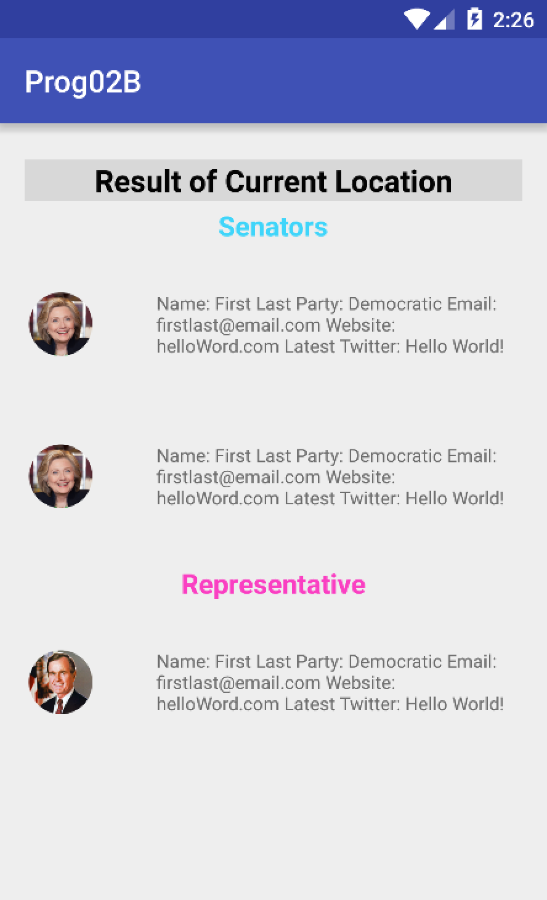
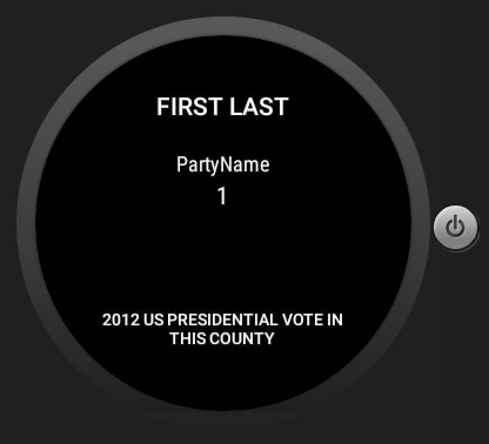
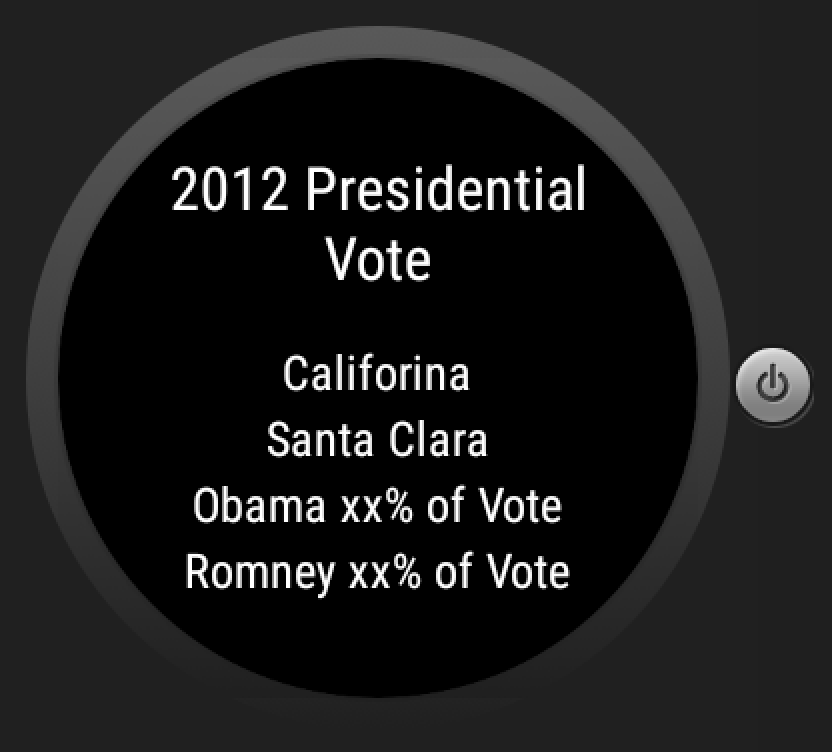

# PROG 02: Represent!

Basic implementation of Represent! App.

## Authors

Chang Liu
([liu.chang@berkeley.edu](mailto:liu.chang@berkeley.edu))

## Demo Video

See PartB
(https://youtu.be/r_AjLemXBoo)

## Screenshots

## Acknowledgments

* Hat tip to anyone who's code was used
* Any other support
